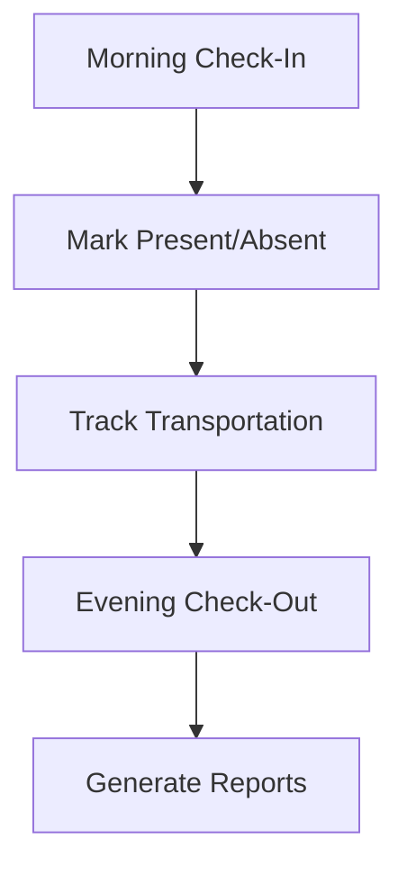

## Overview

Campium equips you with powerful tools to streamline camp management. You handle registrations, billing, attendance, health records, and communications from a single dashboard. These core features ensure smooth operations, data-driven insights, and secure handling of sensitive information.

<Callout kind="info">
Campium centralizes camp operations to save time and reduce errors. Customize workflows to fit your camp's unique needs.
</Callout>

## Key Features Overview

<Columns cols={3}>
  <Card title="Registrations & Enrollments" icon="users" href="#registrations">
    Manage camper sign-ups and capacity limits effortlessly.
  </Card>
  <Card title="Billing & Payments" icon="credit-card" href="#billing">
    Process fees securely with automated invoicing.
  </Card>
  <Card title="Attendance & Transportation" icon="map-pin" href="#attendance">
    Track campers in real-time during sessions and trips.
  </Card>
  <Card title="Medications & Health" icon="shield" href="#health">
    Log and monitor health data for safety.
  </Card>
  <Card title="Communications" icon="message-circle" href="#communications" horizontal>
    Connect staff, campers, and parents instantly.
  </Card>
</Columns>

## Managing Registrations and Enrollments

You create and track camper enrollments with intuitive forms and real-time availability checks.

<Steps>
  <Step title="Set Up Registration Form" icon="edit-3">

    Customize fields for parent info, emergency contacts, and waivers.

    ```
    {
      "fields": [
        "camperName",
        "parentEmail",
        "allergies",
        "emergencyContact"
      ]
    }
    ```

  </Step>
  <Step title="Review Applications" icon="search">

    Approve or waitlist campers based on capacity.

  </Step>
  <Step title="Send Confirmations" icon="send">

    Automate email notifications with enrollment details.

  </Step>
</Steps>

<Callout kind="tip">
Use profile fields to filter enrollments by age group or session type for quick overviews.
</Callout>

## Processing Billing and Payments

Handle payments securely with integrated gateways. Generate invoices and track outstanding balances.

<Tabs>
  <Tab title="Online Payments" icon="globe">

    Configure Stripe or PayPal for seamless transactions.

````jsx
// Payment integration config
const paymentConfig = {
  gateway: "stripe",
  apiKey: "pk_test_YOUR_STRIPE_KEY",
  currency: "USD"
};
````

  </Tab>
  <Tab title="In-Person Collection" icon="dollar-sign">

    Record cash/check payments and print receipts.

    | Method     | Fee Applied | Receipt Generated |
    |------------|-------------|-------------------|
    | Cash       | 0%         | Yes               |
    | Check      | 0%         | Yes               |
    | Card       | 2.9%       | Yes               |

  </Tab>
</Tabs>

## Tracking Attendance and Transportation

Monitor daily attendance and bus routes to ensure camper safety.



<Expandable title="Advanced Tracking Options" default-open="false">

Enable geofencing for buses and automate parent notifications for late arrivals.

</Expandable>

## Logging Medications and Health Records

Securely store and access health information. Staff view allergies and dosages during activities.

<ParamField path="health.medication" param-type="object" required="true">
  Details like name, dosage, and administration time.
</ParamField>

<ParamField path="health.allergies" param-type="array" required="false">
  List of known allergies with severity levels.
</ParamField>

## Facilitating Communications

Keep everyone informed with targeted messages, newsletters, and announcements.

<CodeGroup tabs="Email,SMS">
```javascript
// Send email campaign
await campium.sendEmail({
  to: "parents@camp.com",
  subject: "Session Update",
  body: "Attendance reminder..."
});
```
```javascript
// Send SMS alert
await campium.sendSMS({
  to: "+15551234567",
  message: "Camper pickup at 4PM"
});
```
</CodeGroup>

<Columns cols={2}>
  <Card title="Staff Portal" icon="users">
    Internal chats and shift schedules.
  </Card>
  <Card title="Parent App" icon="smartphone">
    Real-time updates and photo sharing.
  </Card>
</Columns>

<Callout kind="success">
These features integrate seamlessly, providing a complete view of camp operations from your dashboard.
</Callout>