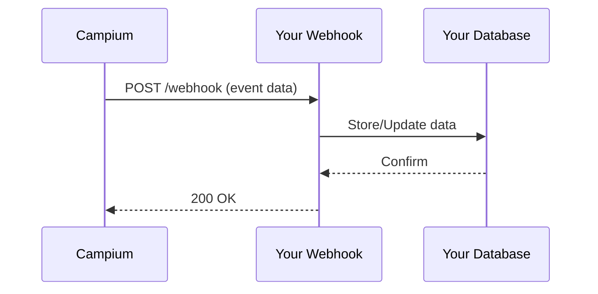

## Overview

Campium supports seamless integrations with popular third-party services to streamline your camp operations. You can connect payment processors for billing, email providers for notifications, webhooks for real-time data sync, and access APIs for custom solutions. These integrations help automate registration payments, attendance updates, and report sharing.

<Callout kind="info">
Review your Campium plan to ensure integration features are enabled. Contact support if you need advanced API access.
</Callout>

## Popular Integrations

Explore key integrations categorized by use case.

<Columns cols={3}>
  <Card title="Payments" icon="credit-card" href="#payment-gateways">
    Connect Stripe, PayPal, and more for secure camper billing.
  </Card>
  <Card title="Email & SMS" icon="mail" href="#email-notifications">
    Integrate with SendGrid, Twilio for automated communications.
  </Card>
  <Card title="Custom Sync" icon="zap" href="#webhooks">
    Use webhooks and APIs for real-time data exchange.
  </Card>
</Columns>

## Payment Gateways

Set up third-party payment gateways to handle camper registrations and fees securely.

### Stripe Integration

Follow these steps to connect Stripe.

<Steps>
  <Step title="Get API Keys" icon="key">
    Log in to your Stripe dashboard and retrieve your publishable and secret keys.
  </Step>
  <Step title="Configure in Campium" icon="settings">
    Navigate to Settings > Payments in Campium. Enter your Stripe keys.
  </Step>
  <Step title="Test Payment" icon="play">
    Create a test registration and process a payment to verify.
  </Step>
</Steps>

<Tabs>
  <Tab title="Stripe" icon="credit-card">
    Use your Stripe keys for seamless billing.
  </Tab>
  <Tab title="PayPal" icon="dollar-sign">
    Configure PayPal by entering your client ID and secret.
  </Tab>
</Tabs>

## Email and Notification Services

Configure providers like SendGrid or Mailgun for camp updates, attendance reminders, and billing receipts.

<Steps>
  <Step title="Select Provider" icon="mail">
    Choose your email service and obtain API credentials.
  </Step>
  <Step title="Add to Campium" icon="plus">
    Go to Settings > Notifications and input your API key and domain.
  </Step>
  <Step title="Verify Setup" icon="check-circle">
    Send a test email from Campium to confirm delivery.
  </Step>
</Steps>

## Webhooks for Real-Time Updates

Webhooks notify external services of events like new registrations or attendance changes.

### Webhook Setup

1. Enable webhooks in Settings > Integrations.
2. Add your endpoint URL, e.g., `https://your-webhook-url.com/webhook`.
3. Select events like `camper.registered` or `attendance.updated`.



<CodeGroup tabs="Node.js,Python">
  ```javascript
  const express = require('express');
  const app = express();
  app.use(express.json());

  app.post('/webhook', (req, res) => {
    const event = req.body;
    if (event.type === 'camper.registered') {
      console.log(`New camper: ${event.data.name}`);
      // Sync to your CRM
    }
    res.status(200).send('OK');
  });

  app.listen(3000);
  ```
  ```python
  from flask import Flask, request, jsonify

  app = Flask(__name__)

  @app.route('/webhook', methods=['POST'])
  def webhook():
      event = request.json
      if event['type'] == 'camper.registered':
          print(f"New camper: {event['data']['name']}")
          # Sync to your CRM
      return jsonify({'status': 'OK'}), 200

  if __name__ == '__main__':
      app.run(port=3000)
  ```
</CodeGroup>

## Exporting Reports

Export custom reports to HTML, PDF, XLS, or Avery labels for sharing with staff or parents.

In the Reports section, apply filters and select your export format. Reports include attendance, billing summaries, and camper profiles.

<Callout kind="tip">
Schedule automated exports via webhooks for daily rosters.
</Callout>

## Custom API Integrations

Access basic endpoints for advanced customizations. Base URL: `https://api.example.com/v1`.

<ParamField path="campers" param-type="GET" required="false">
  Retrieve camper list.
</ParamField>

<ParamField header="Authorization" param-type="string" required="true">
  Bearer `{YOUR_API_TOKEN}`.
</ParamField>

<Request tabs="cURL,JavaScript">
  ```bash
  curl -X GET https://api.example.com/v1/campers \
    -H "Authorization: Bearer YOUR_API_TOKEN"
  ```
  ```javascript
  const response = await fetch('https://api.example.com/v1/campers', {
    headers: {
      'Authorization': 'Bearer YOUR_API_TOKEN'
    }
  });
  const campers = await response.json();
  ```
</Request>

<Response tabs="200">
  ```json
  {
    "campers": [
      {
        "id": "cmp_123",
        "name": "Jane Doe",
        "attendance": "present"
      }
    ]
  }
  ```
</Response>

<Expandable title="Advanced API Limits" default-open="false">
  Rate limits: 100 requests per minute. Use pagination for large datasets with `?page=1&limit=50`.
</Expandable>